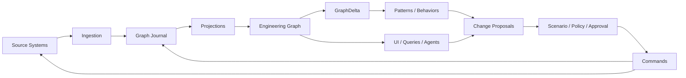

# Target Operating Model

> **Status:** Proposed reference specification  
> **Project:** GOLEM — Go Open Lifecycle & Engineering Manager  
> **Baseline reviewed:** `main` around commit `113c868…` (2026-08-19)  
> **Goal:** evolve GOLEM into an **Active Engineering Graph** / auditable engineering digital twin.  

## Personas

GOLEM serves:

- developers;
- platform engineers;
- DevOps/SRE;
- security engineers;
- architects;
- QA/UAT coordinators;
- engineering managers;
- compliance/audit;
- autonomous/assisted agents.

## Operating loop

## Responsibility split

### Source systems
Operational source of truth for provider-local facts.

### GOLEM Journal
Authoritative history of accepted canonical engineering facts and decisions.

### Engineering Graph
Canonical semantic projection for cross-domain reasoning.

### Search/Analytics
Derived projections optimized for text search and aggregation.

### Behaviors
Deterministic/reactive automation over events and graph changes.

### Agents
Contextual reasoning over bounded evidence; produce explanations and proposals.

### Change Proposals
Boundary between recommendation and mutation.

## Deployment model

- Global control plane: tenant catalog, entitlements, routing, minimal global metadata.
- Cells: journal, graph, search, behaviors, ingestion, agent runtime and APIs.
- Heavy workloads: separately scalable workers where required.
