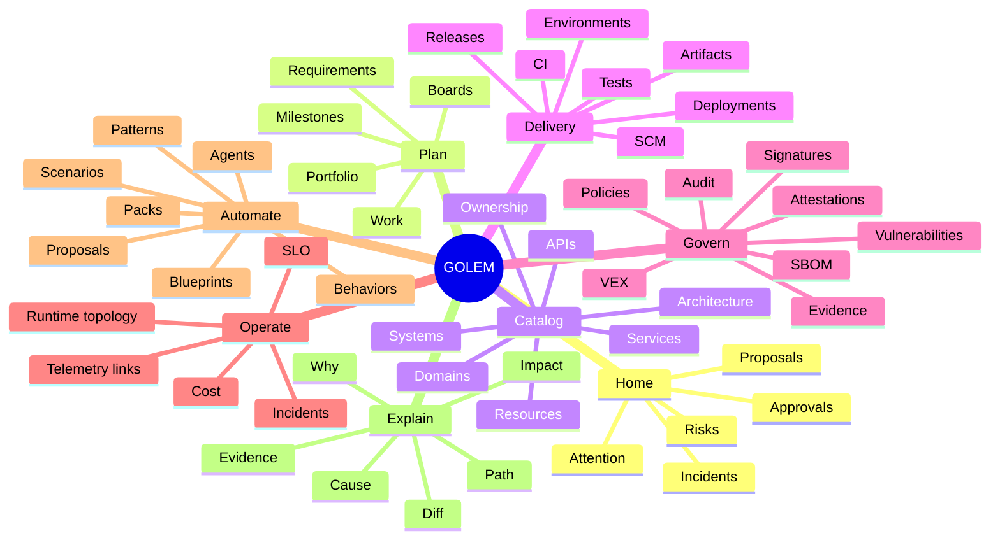

# Capability Map v2

> **Status:** Proposed reference specification  
> **Project:** GOLEM — Go Open Lifecycle & Engineering Manager  
> **Baseline reviewed:** `main` around commit `113c868…` (2026-08-19)  
> **Goal:** evolve GOLEM into an **Active Engineering Graph** / auditable engineering digital twin.  

## Capability grouping rule

Navigation groups user intent. Internal bounded contexts do not dictate top-level navigation.

## Cross-cutting capabilities

The following are available from entity context rather than as isolated products:

- Search / omnibox
- Why
- Impact
- Simulate
- Propose Change
- Evidence
- History
- Policies
- Graph Lens
