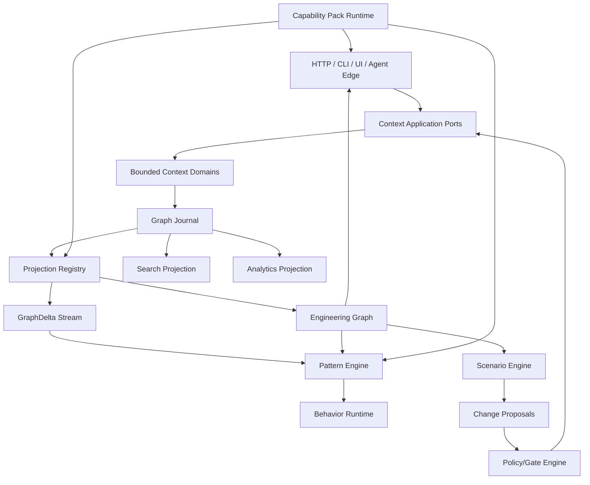

# Target Architecture

> **Status:** Proposed reference specification  
> **Project:** GOLEM — Go Open Lifecycle & Engineering Manager  
> **Baseline reviewed:** `main` around commit `113c868…` (2026-08-19)  
> **Goal:** evolve GOLEM into an **Active Engineering Graph** / auditable engineering digital twin.  

## Architectural style

- modular monolith by default;
- vertical hexagons by bounded context;
- append-only authoritative journal;
- graph/search/analytics projections;
- graph-reactive runtime;
- cell-based SaaS scale.

## Logical architecture

## Kernel responsibilities

Kernel remains intentionally small:

- event envelope;
- journal transaction boundary;
- tenant/actor/correlation model;
- command contract;
- projection registration;
- graph mutation contract;
- extension lifecycle;
- budgets/permissions.

Business domains do not belong in kernel switches.

## Evolution boundary

Separate processes are justified when:
- independent scaling is measured;
- failure isolation is needed;
- workload has distinct resource profile;
- ownership boundary is stable;
- latency/SLO requires it.

Do not preemptively split contexts into services.
