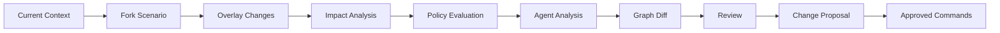

# Temporal Graph and Scenario Architecture

> **Status:** Proposed reference specification  
> **Project:** GOLEM — Go Open Lifecycle & Engineering Manager  
> **Baseline reviewed:** `main` around commit `113c868…` (2026-08-19)  
> **Goal:** evolve GOLEM into an **Active Engineering Graph** / auditable engineering digital twin.  

## Temporal questions

GOLEM should support:
- graph as of journal position/time;
- edge/node validity intervals;
- diff between two known states;
- scenario overlay over a base state.

## Scenario model

A scenario is not a full graph copy.

```text
Scenario
  base_journal_position
  overlay_mutations[]
  assumptions[]
  generated_evidence[]
  proposals[]
  policy_results[]
```

## Evaluation

```text
Base Graph @ P
   +
Overlay
   =
Scenario View
```

## Scenario workflow



## Guarantees

- scenario cannot mutate base graph;
- every simulated fact is marked scenario-local;
- production commands are generated only after proposal approval;
- diff is deterministic for deterministic overlay;
- agent-generated assumptions are explicitly PREDICTED.

## Storage

Prefer sparse overlay + immutable base reference. Materialize temporary graph snapshots only for expensive workloads where measurement justifies it.
