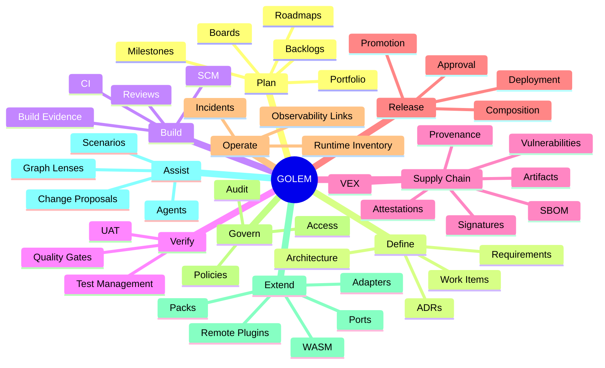

# Capability Map

```mermaid
mindmap
  root((GOLEM))
    Plan
      Portfolio
      Roadmaps
      Backlogs
      Boards
      Milestones
    Define
      Requirements
      Work Items
      Architecture
      ADRs
    Build
      SCM
      Reviews
      CI
      Build Evidence
    Verify
      Test Management
      UAT
      Quality Gates
    Supply Chain
      Artifacts
      SBOM
      Provenance
      Signatures
      Vulnerabilities
      VEX
      Attestations
    Release
      Composition
      Promotion
      Approval
      Deployment
    Operate
      Runtime Inventory
      Incidents
      Observability Links
    Govern
      Policies
      Access
      Audit
    Extend
      Ports
      Adapters
      Packs
      WASM
      Remote Plugins
    Assist
      Graph Lenses
      Agents
      Scenarios
      Change Proposals
```
