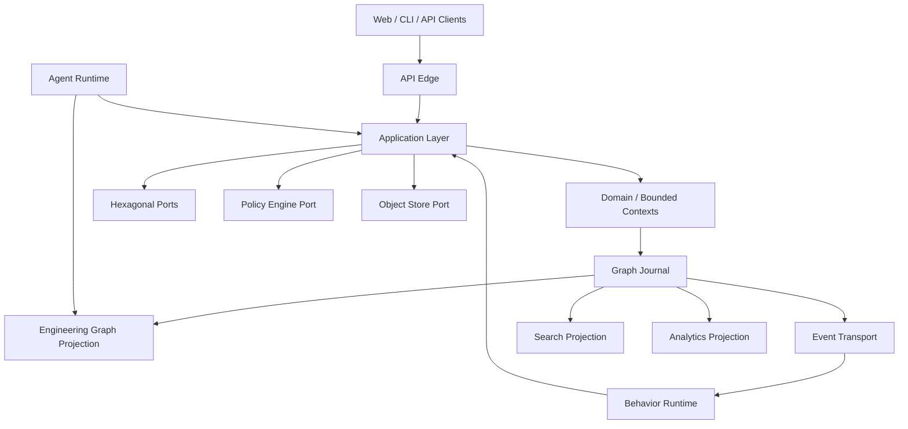
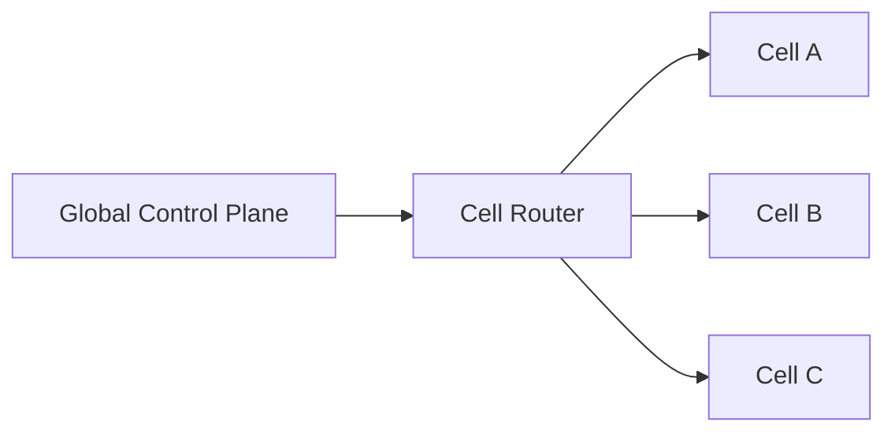

# GOLEM — Go Open Lifecycle & Engineering Manager

> **Graph-native, event-driven, auditable software engineering control plane.**

**Document baseline:** 0.1  
**Architecture style:** Hexagonal + event-sourced + graph-native + evolutionary  
**Primary implementation language:** Go  
**Deployment target:** Multi-tenant SaaS with cell-based horizontal scaling  

# Arquitectura de referencia

## Vista lógica

## Fuente de verdad

GOLEM separa:
1. **modelo canónico:** Engineering Graph;
2. **historia autoritativa:** Graph Journal append-only;
3. **proyecciones:** graph DB materializada, search, analytics, caches.

Una projection debe poder reconstruirse desde Journal + snapshots/checkpoints verificables.

## Evolución

### A — Modular monolith por cell
Un binario API y workers separados donde convenga. Boundaries se mantienen aunque compartan proceso.

### B — Process isolation
Projection workers, ingestion, behavior workers y heavy jobs se separan sin cambiar contracts.

### C — Service extraction
Sólo con evidencia de carga, ownership, escalado independiente o risk isolation.

## Cell architecture

Control plane: tenant catalog, routing, entitlements y operación global mínima. Datos de ingeniería en la cell.

## Write path

`Request → AuthN/AuthZ → Command → Domain validation → Journal append → Accepted Event → Outbox/Projection → Async reactions`

## Read path

`Query → Tenant Scope → Query Budget → Graph/Search/Analytics Projection → Stable DTO`

## Consistencia

- command acceptance fuerte dentro del invariant boundary;
- projections eventuales con lag medido;
- sinks at-least-once e idempotentes;
- command receipt incluye Journal position para read-your-write opcional.

## Extensibilidad

Ports/adapters, Capability Packs, WASM y remote plugin protocol.

## Seguridad

Tenant, actor, correlation, causation y policy result acompañan acciones relevantes. Secrets nunca entran en Journal.
