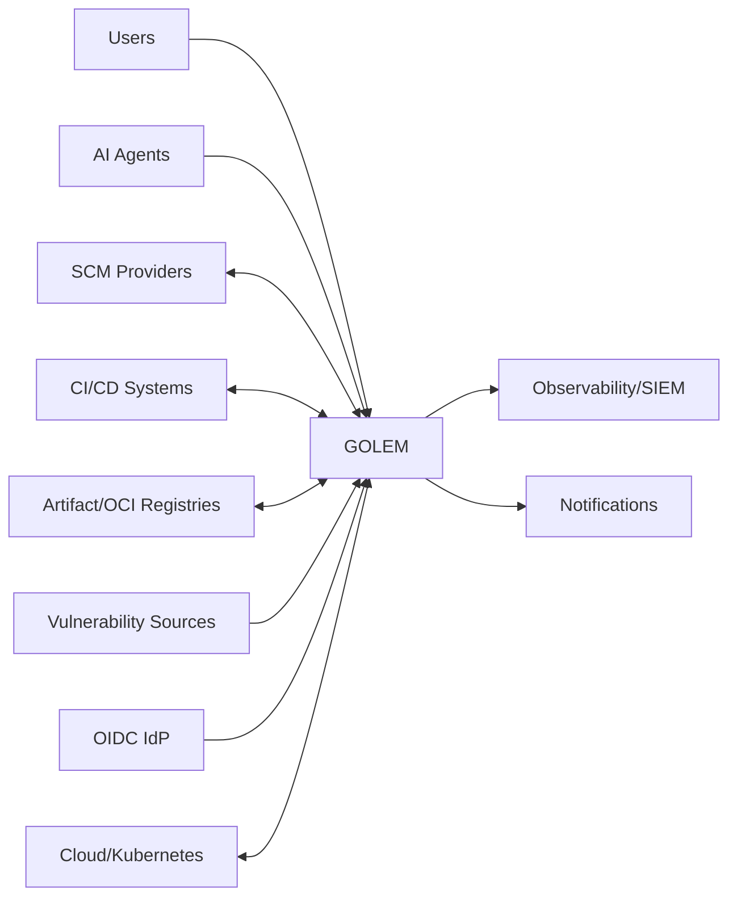

# System Context

## Trust boundaries
Internet/API edge, tenant, cell, plugin/WASM, external provider, privileged administration y artifact/evidence.

## Integration philosophy
GOLEM ingiere facts y emite commands/events mediante adapters. Sistemas externos conservan ownership de repos/blobs/runtime; GOLEM mantiene identity, relations, evidence y lifecycle.
