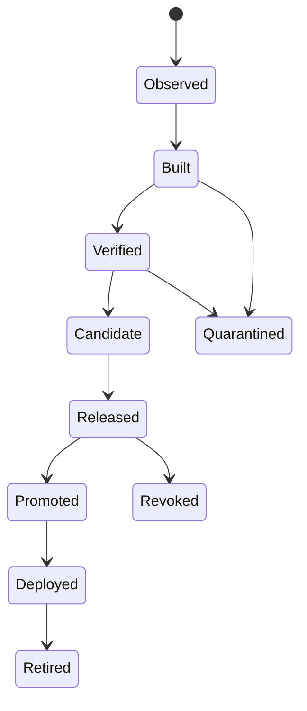

# Artifact Lifecycle

## Identity
`ArtifactID = algorithm + digest`; tags/names son aliases.

## Relations
PRODUCED_BY, HAS_SBOM, ATTESTED_BY, SIGNED_BY, CONTAINS, PART_OF y DEPLOYED_AS.

## Promotion
No cambia identity: cambia eligibility/location/state y genera evidence.

## Revocation
Evento + reason/evidence + recalculation de releases/deployments + notifications/policies.
