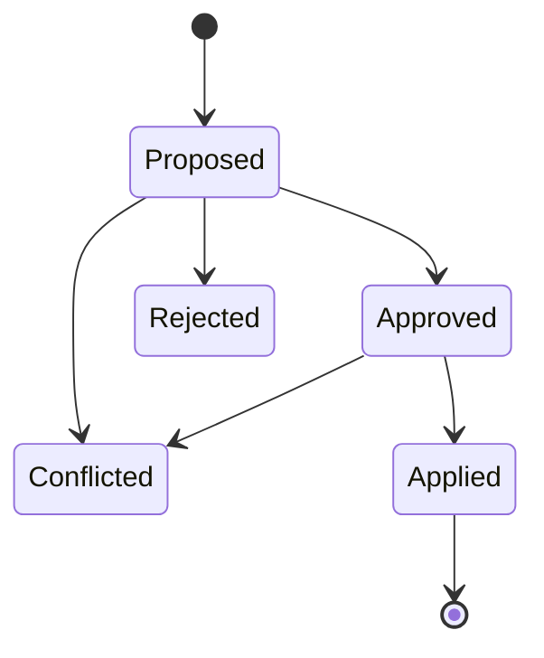

# Change Proposals

## Modelo
`id, tenant, actor, frame, target, observed_revision, operations[], rationale, evidence_refs[], risk, status`.

## Lifecycle

## Canonical operations
CreateNode, UpdateNode, RemoveNode, AddEdge, RemoveEdge, EmitDomainEvent y RequestExternalAction.

## Optimistic concurrency
Revision obsoleta ⇒ CONFLICTED, sin merge silencioso.

## Dry-run
Toda proposal puede producir Graph Diff antes de apply.
