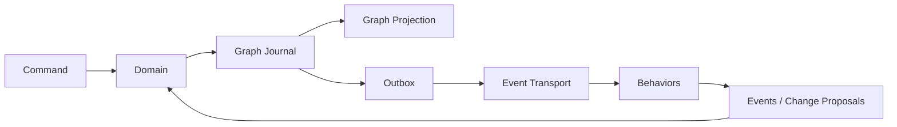

# GOLEM — Go Open Lifecycle & Engineering Manager

> **Graph-native, event-driven, auditable software engineering control plane.**

**Document baseline:** 0.1  
**Architecture style:** Hexagonal + event-sourced + graph-native + evolutionary  
**Primary implementation language:** Go  
**Deployment target:** Multi-tenant SaaS with cell-based horizontal scaling  

# DESIGN — Implementation Blueprint

## 1. Summary

GOLEM es un Engineering Lifecycle Manager que combina ALM, Engineering Graph, supply-chain security y automatización/agents sobre un sustrato event-sourced.

El modelo canónico es el **Engineering Graph**; la historia autoritativa es el **Graph Journal**. Todos los servicios externos se consumen a través de Ports y los adapters críticos deben superar TCKs de conformidad.

## 2. Goals

- reimplementar las capabilities ALM valiosas de Tuleap;
- traceability causal de requirement a runtime;
- modelado graph-native;
- supply-chain evidence first-class;
- SaaS horizontal por cells;
- provider independence;
- agents seguros mediante Lenses/Frames/Proposals;
- replay/fork/diff/promote.

## 3. Non-goals v1

Active-active multi-region writes, IDE completo, reemplazo de Git/OCI/Kubernetes y marketplace masivo.

## 4. Core runtime

## 5. Engineering Graph

Nodos y edges tipados con tenant/revision/provenance. Artifacts content-addressed. Relations expresan implementación, build, contains, verification, deployment, ownership, evidence y causalidad.

## 6. Behavior model

Behaviors deterministas primero. Agentic sólo cuando el problema necesita reasoning probabilístico. Pattern subscriptions están acotadas/compiladas. Relation Behaviors se usan cuando la lógica pertenece a un edge.

## 7. Security & supply chain

SourceRevision→Build→Artifact→SBOM/Provenance/Signature→Release→Deployment. Policy evalúa evidence; VEX participa en la decisión de vulnerabilidad.

## 8. Extensibility

- Port/Adapter: infraestructura.
- Capability Pack: dominio.
- WASM: código aislado.
- Remote plugin: integración pesada.
- OCI: distribución de Packs.
- TCK: compatibilidad semántica.
- R0–R5: replaceability fitness.

## 9. Multi-tenancy

Tenants en cells; TenantContext obligatorio end-to-end; control plane global mínimo. Dedicated/Sovereign se resuelve con Provider Profiles y cells, no con forks del producto.

## 10. Data ownership

Journal es autoritativo. Graph/search/analytics son projections; object storage contiene blobs content-addressed; secrets viven en secret provider.

## 11. Public contracts

OpenAPI + AsyncAPI + JSON Schema. RPC interno opcional con ConnectRPC/gRPC. Event schemas versionados.

## 12. UI

Web UI como adapter. Workspace multi-view: table/board/graph/timeline, inspector, evidence, causal history, policy, scenarios y semantic zoom.

## 13. Deployment evolution

1. kernel;
2. modular cell;
3. isolated workers;
4. service extraction by evidence;
5. multi-cell;
6. multi-region only after spike.

## 14. Implementation order

Leer [`08_DELIVERY/IMPLEMENTATION_SEQUENCE.md`](08_DELIVERY/IMPLEMENTATION_SEQUENCE.md). El primer vertical slice debe demostrar replay determinista antes de ampliar funcionalidades.

## 15. Decisions

Los 52 ADRs están en [`07_ADR/ADR-CATALOG.md`](07_ADR/ADR-CATALOG.md).
